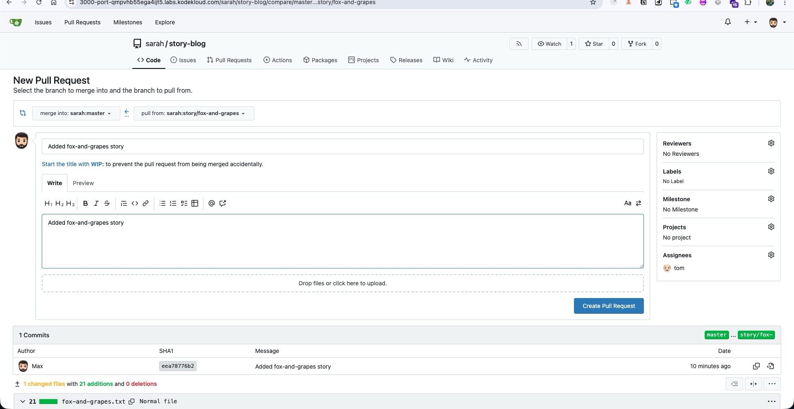
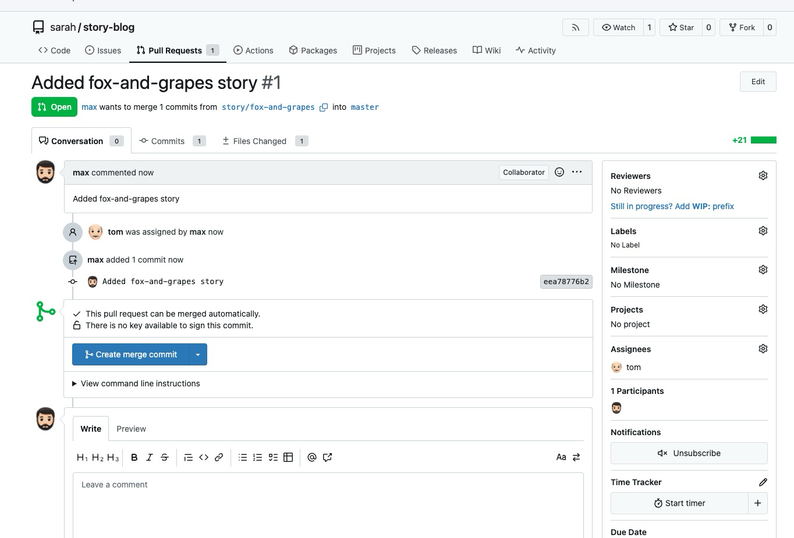
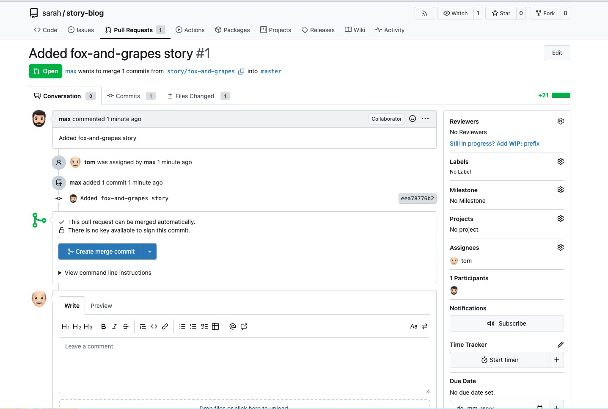
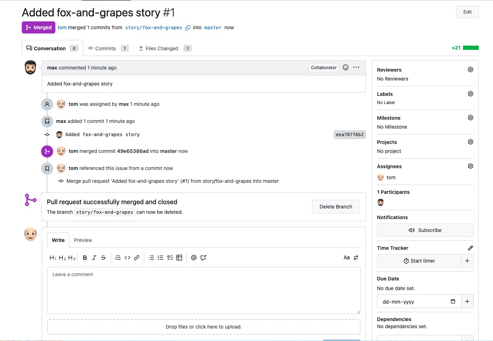

# Día 29 - Flujo de Pull Request en Gitea: rama feature → master

## Problema / Desafío

Max escribió una historia en el branch `story/fox-and-grapes` y la pusheó al repositorio remoto en Gitea. No se permite pushear directamente a `master` — todo cambio debe pasar por revisión. El flujo requerido:

1. Verificar el estado del repo local y el historial de commits
2. Crear un Pull Request en Gitea: `story/fox-and-grapes` → `master`
   - Título: `Added fox-and-grapes story`
3. Asignar a `tom` como reviewer
4. Aprobar y mergear el PR como usuario `tom`

## Conceptos clave

### Pull Request (PR)

Un Pull Request es una solicitud formal para integrar los cambios de un branch en otro. No es una funcionalidad de Git en sí — es una capa que añaden plataformas como Gitea, GitHub o GitLab sobre Git para habilitar revisión de código antes del merge.

```
story/fox-and-grapes:  ... → [Added fox-and-grapes story]
                                          ↓ PR
master:                ... → Merge branch 'story/frogs-and-ox' → [merge del PR]
```

### Por qué proteger master

| Sin protección | Con PRs obligatorios |
|----------------|----------------------|
| Cualquiera puede pushear directamente | Solo merges revisados llegan a master |
| Errores llegan directo a produccion | Hay al menos un par de ojos revisando |
| Historia de master mezclada con WIP | master siempre tiene codigo aprobado |
| Dificil auditar quién aprobó qué | Queda registro del revisor y la decision |

### Flujo completo del PR

```
Developer (max)               Reviewer (tom)           master
     |                              |                     |
  git push                          |                     |
  origin story/fox-and-grapes       |                     |
     |                              |                     |
  Crea PR en UI ──────────────────> |                     |
  (asigna reviewer: tom)            |                     |
                                 Revisa diff              |
                                 Aprueba PR               |
                                 Merge ──────────────────>|
                                                     PR mergeado
```

### Branch naming convention: `story/<nombre>`

El prefijo `story/` en el nombre del branch es una convención para agrupar branches por tipo de trabajo. Otras convenciones comunes:

| Prefijo | Uso |
|---------|-----|
| `feature/` | Nueva funcionalidad |
| `fix/` o `bugfix/` | Corrección de bug |
| `hotfix/` | Corrección urgente en produccion |
| `story/` | Historia de usuario (Scrum) |
| `release/` | Preparacion de una version |

## Pasos

### Terminal — verificar el repo

1. Conectarse como `max`
2. Navegar al repo clonado
3. Validar branches y historial de commits

### Gitea UI — crear y mergear el PR

4. Crear el PR desde `story/fox-and-grapes` hacia `master`
5. Asignar a `tom` como reviewer
6. Cerrar sesión de `max`, iniciar sesión como `tom`
7. Revisar y aprobar el PR
8. Mergear el PR

## Comandos / Código

### 1. Conectarse y verificar el repo

```bash
ssh max@ststor01
cd story-blog/
```

### 2. Validar branches

```bash
git branch
```

```
  master
* story/fox-and-grapes
```

```bash
git branch -a
```

```
  master
* story/fox-and-grapes
  remotes/origin/HEAD -> origin/master
  remotes/origin/master
  remotes/origin/story/fox-and-grapes
```

### 3. Revisar el historial de commits

```bash
git log --oneline
```

```
eea7877 (HEAD -> story/fox-and-grapes, origin/story/fox-and-grapes) Added fox-and-grapes story
7252df6 (origin/master, origin/HEAD, master) Merge branch 'story/frogs-and-ox'
e8179a8 Fix typo in story title
c1ba4a6 Completed frogs-and-ox story
118593d Added the lion and mouse story
699f1ec Add incomplete frogs-and-ox story
```

El commit `eea7877` está en `story/fox-and-grapes` pero no en `master` (master apunta a `7252df6`).

### 4. Confirmar que el branch está pusheado

```bash
git push origin
```

```
Everything up-to-date
```

El branch ya estaba en el remote — listo para crear el PR.

### 5. Crear el PR en Gitea UI

- Ir a la UI de Gitea
- **New Pull Request**
- Source branch: `story/fox-and-grapes`
- Target branch: `master`
- Título: `Added fox-and-grapes story`
- Asignar reviewer: `tom`
- Crear PR
  



### 6. Revisar y mergear como tom

- Cerrar sesión de `max`
- Iniciar sesión como `tom` (Tom_pass123)
- Abrir el PR `Added fox-and-grapes story`
- Revisar los cambios (diff)
- Aprobar y mergear




## Troubleshooting

| Problema | Solucion |
|----------|----------|
| No aparece el boton de crear PR | Verificar que el branch fue pusheado al remote con `git push origin <branch>` |
| No se puede asignar reviewer | El usuario debe existir en Gitea y tener acceso al repositorio |
| El PR no puede mergearse (conflictos) | Resolver conflictos localmente, pushear y el PR se actualizara automaticamente |
| No aparece el branch en Gitea | El branch solo existe localmente. Hacer `git push origin story/fox-and-grapes` |

## Recursos

- [Gitea - Pull Requests](https://docs.gitea.com/usage/pull-request)
- [Atlassian - Making a Pull Request](https://www.atlassian.com/git/tutorials/making-a-pull-request)
